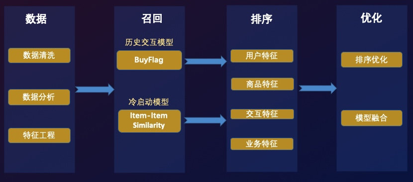
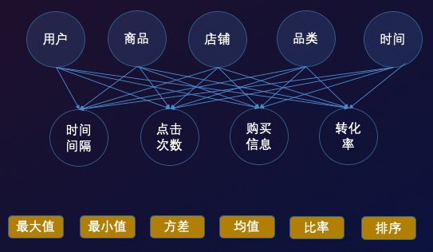
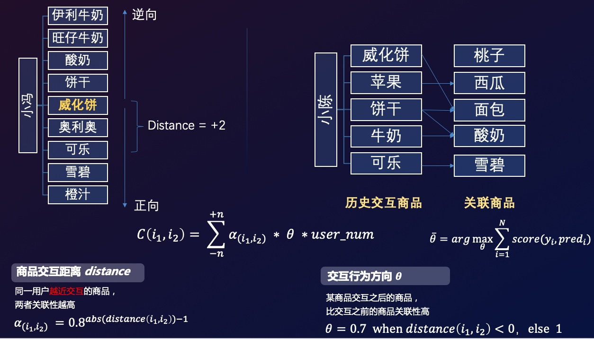
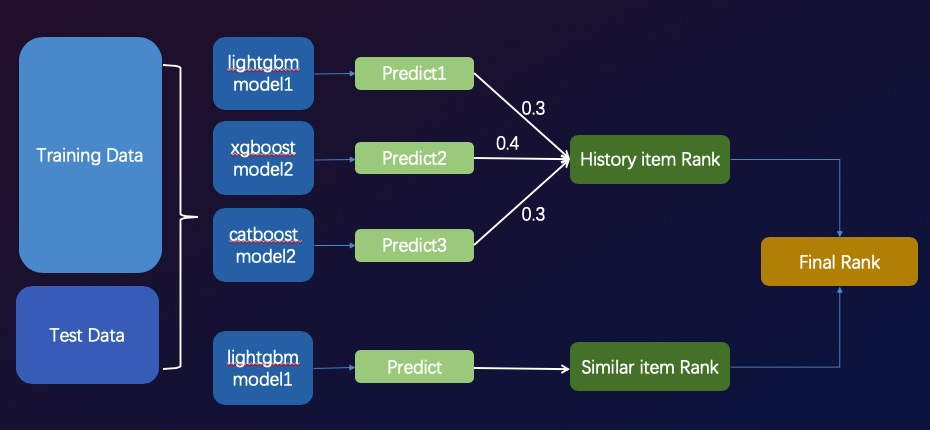
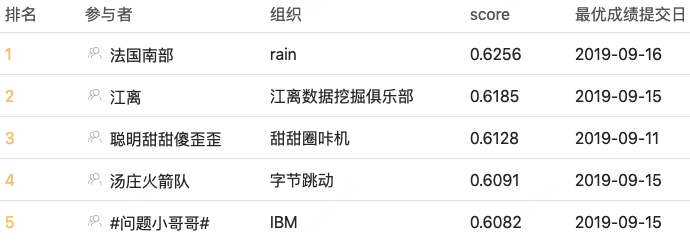

# 天池-安泰杯跨境电商智能算法大赛 冠军方案分享
[天池-跨境电商智能算法大赛](https://tianchi.aliyun.com/competition/entrance/231718/introduction)

代码相关问题，请到Issues区进行留言

## 赛题
AliExpress是阿里巴巴海外购物网站，海外用户可以在AliExpress挑选购买自己心意的商品。AliExpress积累了大量的用户行为数据，本赛题旨在通过海量数据挖掘用户下一个可能交互商品，选手们可以提交预测的TOP30商品列表，排序越靠前命中得分越高。

### 赛题数据
根据零售行业的**人货场**概念，赛题提供了关于用户行为日志的常见字段可分为如下部分：
* 用户：用户标识、用户国籍
* 商品：商品标识、店铺、品类、价格
* 场景：点击时间、访问排序、购买标记

评分公式MRR(Mean Reciprocal Rank)：

### 赛题分析
通过对赛题数据进行探索和分析，我们发现可以根据**预测商品是否在历史交互过**分成两种不同分布的用户：

*  历史交互用户：即预测商品用户曾经已交互过，在召回-排序阶段：
召回：可通过buy_flag=1，将交互商品全量召回
排序：基于用户商品交互信息，解决排序问题，预测精度高

* 冷启动用户：即预测商品用户从未交互过，在召回-排序阶段：
召回：基于商品关联信息召回，召回难度大
排序：基于用户最近交互商品与关联信息进行排序，预测精度较低

方案思路：面对两种不同分布的用户，我们因地制宜基于不同样本和特征分别建立两个排序模型，然后再通过用户判断模型对两个排序的结果进行优化。

## 数据
### 数据分析
相关数据分析和可视化参见：[GitHub](https://github.com/RainFung/awesome-visualization/blob/master/Electronic-Commerce/%E9%98%BF%E9%87%8C%E8%B7%A8%E5%A2%83%E7%94%B5%E5%95%86%E6%99%BA%E8%83%BD%E7%AE%97%E6%B3%95%E5%A4%A7%E8%B5%9B-%E6%95%B0%E6%8D%AE%E6%8E%A2%E7%B4%A2%E4%B8%8E%E5%8F%AF%E8%A7%86%E5%8C%96.ipynb)

### 特征工程
赛题所给的字段相对简单，主要可分为：用户-商品-场景，我们通过对不同类型因素进行交叉复合，并使用基础统计手段进行计算，构造出高阶特征，提取出购物决策的相关信息：

## 模型
### 历史交互商品模型
* 样本构造：提取buy_flag=1的user-item作为样本，用户最后交互的设为正样本，其他为负样本

* 模型信息：
 - 训练集样本数：137W
 - 训练集用户数：55W
 - 测试集样本数：3.1W
 - 测试集用户数：8944
 - 特征数量：425
 - Model：LightGbm 
 - loss function：AUC

* 模型效果：
AUC: 0.9493
MRR: 0.8922
Recall Rate：
 - Top1 item：81%
 - Top3 item：92.5%
 - Top10 item：99%

### 关联商品模型
key：挖掘商品间关联关系，根据用户历史交互商品，推荐关联商品

* Item-Item similarity Based on Sequnence
商品相似性：基于用户行为序列计算，假设用户越近交互的两个商品相似性越高，并且考虑先后次序，通过线性搜索得到如下相似度计算公式：

* 样本构造：对用户最近5个交互商品的关联商品(加上时间衰减权重)，选取每个用户TOP50关联商品，之前得到的关联度中间结果直接作为特征训练排序模型

* 模型信息：
 - 训练集样本数：940W
 - 训练集用户数：18W
 - 测试集样本数：47W
 - 测试集用户数：8944
 - 特征数量：222
 - Model：LightGbm 
 - loss function：AUC

* 模型效果：
AUC: 0.9736
MRR: 0.0554
Rcall Rate：
 - Top1 item：3.1%
 - Top3 item：6.3%
 - Top30 item：15%

## 优化
### 排序优化

如图所示，历史商品模型排序第4的商品召回率仅有1.5，而关联模型排序第一位召回率为3.1。
为了优化排序结果，优化两部分模型的结果，通过**用户判别模型(预测用户是否为冷启动用户)**，对概率大于0.95的高置信度用户直接截取掉历史TOP3后，与商品与关联模型的结果进行拼接，得到最终的Top30商品排序。

### 模型融合
* Enseblem
对于历史交互商品模型，训练了LightGBM、Xgboost、CatBoost三个模型，通过对预测结果简单加权进行融合。

* Stacking
此外，在每个模型训练过程中通过简单Stacking将其他4折的预测结果作为特征反喂模型，进一步拟合结果。

通过优化阶段，我们将分数从0.6198提升到0.6256，进一步拉开了与其他队伍的差距。

## 总结
在本次比赛前期，我花费了大量精力进行数据探索和分析，基于对数据和业务的了解才确立了最终的方案和优化路线。当对数据之间的联系了然于心后，开始进行细致的特征工程以提取各种信息，在也是历史交互模型得分提升的关键。此后，为了提高召回率，尝试了Embedding、协同过滤等方法，但是由于数据量和category字段少的限制，都没取得太好的效果，开始基于业务理解，尝试建立关联度计算公式，通过不断搜索参数，取得了不错的召回率，由此建立关联商品模型，此时成绩也上升到第一名。最后阶段，我们开始提高模型的精度和稳定性，一是建立了用户判别模型对排序进行了优化，二是对模型进行了融合以及stacking，得到了0.6256分数，进一步扩大了领先优势。

取胜关键 = 充分理解业务 + 完备的特征工程 + 合理建模方法 + 细致结果优化 + 坚持就是胜利

> 本赛题相关资料目前已上传[GitHub](https://github.com/RainFung/Tianchi-AntaiCup-International-E-commerce-Artificial-Intelligence-Challenge)，代码待整理完毕后也将开源共享
> Have a good time in Data Competition.

